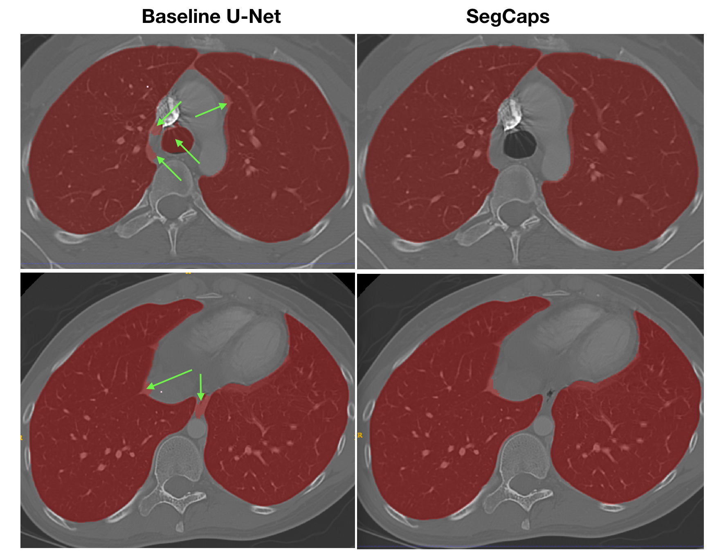
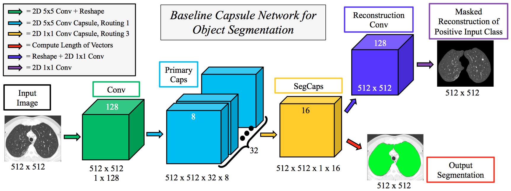
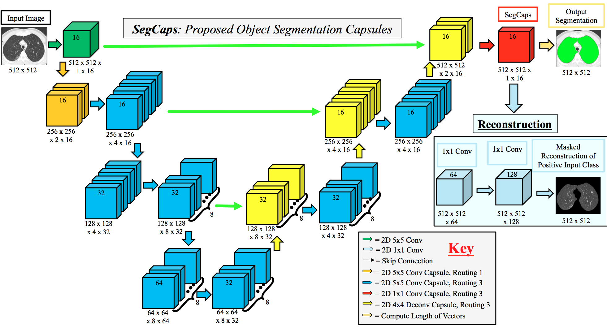
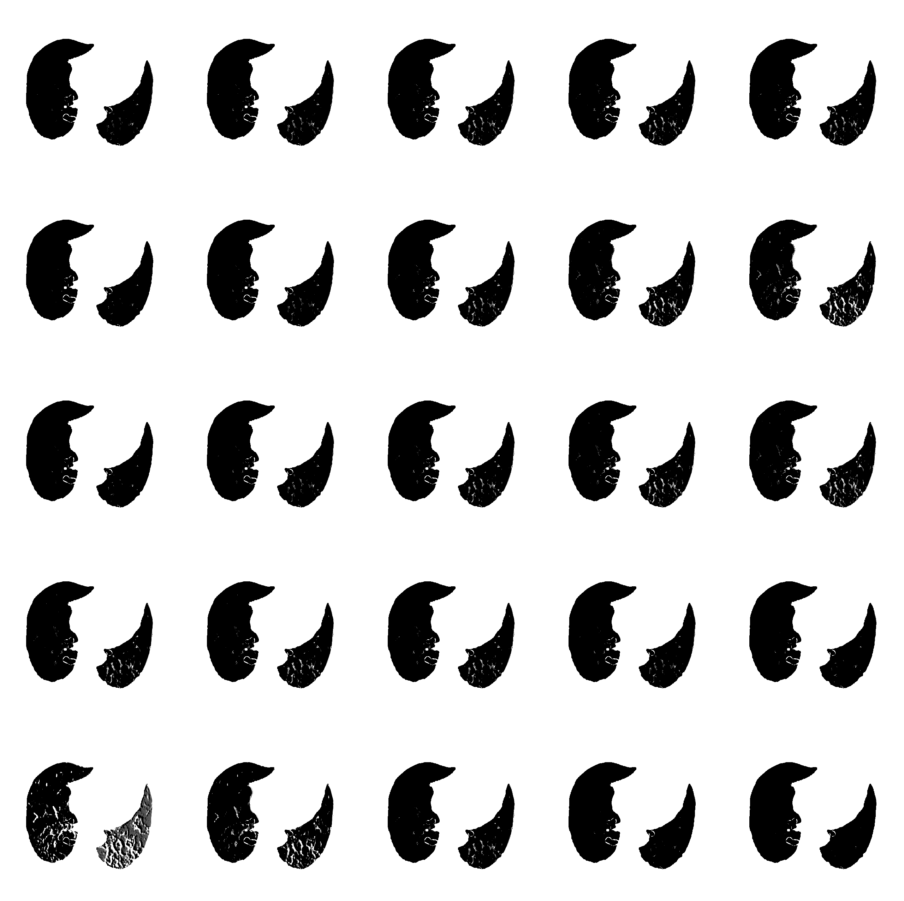

# Capsules for Object Segmentation (SegCaps)
### by [Rodney LaLonde](https://rodneylalonde.wixsite.com/personal) and [Ulas Bagci](http://www.cs.ucf.edu/~bagci/)

## This repo is the official implementation of SegCaps

The original paper for SegCaps can be found at https://arxiv.org/abs/1804.04241.

A project page for this work can be found at https://rodneylalonde.wixsite.com/personal/research-blog/capsules-for-object-segmentation.



## Condensed Abstract
Convolutional neural networks (CNNs) have shown remarkable results over the last several years for a wide range of computer vision tasks. A new architecture recently introduced by [Sabour et al., referred to as a capsule networks with dynamic routing](https://arxiv.org/abs/1710.09829), has shown great initial results for digit recognition and small image classification. Our work expands the use of capsule networks to the task of object segmentation for the first time in the literature. We extend the idea of convolutional capsules with *locally-connected routing* and propose the concept of *deconvolutional capsules*. Further, we extend the masked reconstruction to reconstruct the positive input class. The proposed convolutional-deconvolutional capsule network, called **SegCaps**, shows strong results for the task of object segmentation with substantial decrease in parameter space. As an example application, we applied the proposed SegCaps to segment pathological lungs from low dose CT scans and compared its accuracy and efficiency with other U-Net-based architectures. SegCaps is able to handle large image sizes (512 x 512) as opposed to baseline capsules (typically less than 32 x 32). The proposed SegCaps reduced the number of parameters of U-Net architecture by **95.4%** while still providing a better segmentation accuracy.

## Baseline Capsule Network for Object Segmentation



## SegCaps (R3) Network Overview



## Quantative Results on the LUNA16 Dataset

| Method           | Parameters | Split-0 (%) | Split-1 (%) | Split-2 (%) | Split-3 (%) | Average (%) |
|:---------------- |:----------:|:-----------:|:-----------:|:-----------:|:-----------:|:-----------:|
| U-Net            | 31.0 M     | 98.353      | 98.432      | 98.476      | **98.510**  | 98.449      |
| Tiramisu         | 2.3 M      | 98.394      | 98.358      | **98.543**  | 98.339      | 98.410      |
| Baseline Caps    | 1.7 M      | 82.287      | 79.939      | 95.121      | 83.608      | 83.424      |
| SegCaps (R1)     | **1.4 M**  | 98.471      | 98.444      | 98.401      | 98.362      | 98.419      |
| **SegCaps (R3)** | **1.4 M**  | **98.499**  | **98.523**  | 98.455      | 98.474      | **98.479**  |

## Results of Manipulating the Segmentation Capsule Vectors



## Getting Started Guide

### Install Required Packages
This repo of code is written for Keras using the TensorFlow backend. Please install all required packages before using this code.
```bash
pip install -r requirements.txt
```

### Dataset Structure

Inside the data root folder (*i.e.* where you have your data stored) you should have two folders: one called *imgs* and one called *masks*. All models, results, etc. are saved to this same root directory.

### Main File

From the main file (main.py) you can train, test, and manipulate the segmentation capsules of various networks. Simply set the ```--train```, ```--test```, or ```--manip flags``` to 0 or 1 to turn these off or on respectively. The argument ```--data_root_dir``` is the only required argument and should be set to the directory containing your *imgs* and *masks* folders. There are many more arguments that can be set and these are all explained in the main.py file. 

### Citation

If you use significant portions of our code or ideas from our paper in your research, please cite our work:
```
@article{lalonde2018capsules,
  title={Capsules for Object Segmentation},
  author={LaLonde, Rodney and Bagci, Ulas},
  journal={arXiv preprint arXiv:1804.04241},
  year={2018}
}
```

### Questions or Comments

Please direct any questions or comments to me; I am happy to help in any way I can. You can either comment on the [project page](https://rodneylalonde.wixsite.com/personal/research-blog/capsules-for-object-segmentation), or email me directly at lalonde@knights.ucf.edu.
